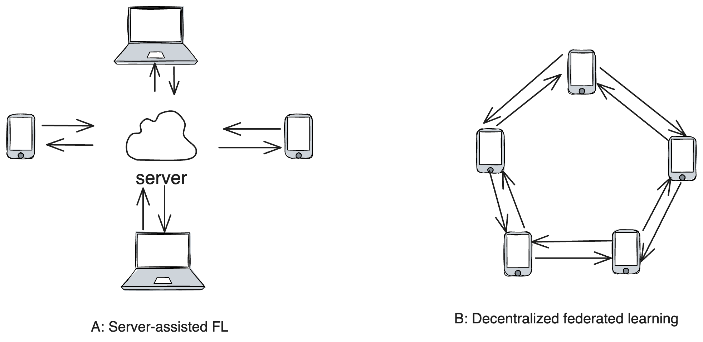

# Description 
The “Tempered Training: Poisoning-Resistant Federated Learning for Blockchain (TT-FL-B)” project implements a secure federated learning framework specifically designed for blockchain applications. It leverages Byzantine Fault Tolerance (BFT) mechanisms to ensure model robustness against malicious actors attempting to manipulate training data. By enabling secure and decentralized training across multiple participants, this project empowers blockchain systems with enhanced learning capabilities while preserving data privacy.

# ABSTRACT
Federated learning (FL) enables multiple clients to collaboratively train machine learning models without revealing their private training data. In conventional FL, the system follows the server-assisted architecture (server-assisted FL), where the training process is coordinated by a central server. However, the server-assisted FL framework suffers from poor scalability due to a communication bottleneck at the server, and trust dependency issues. To address challenges, decentralized federated learning (DFL) architecture has been proposed to allow clients to train models collaboratively in a serverless and peer-to-peer manner. However, due to its fully decentralized nature, DFL is highly vulnerable to poisoning attacks, where malicious clients could manipulate the system by sending carefully-crafted local models to their neighboring clients. To date, only a limited number of Byzantine-robust DFL methods have been proposed, most of which are either communication-inefficient or remain vulnerable to advanced poisoning attacks

## Dependency

## Usage

## Problems Addressed and Their Solutions

## REFERENCES
TODO
